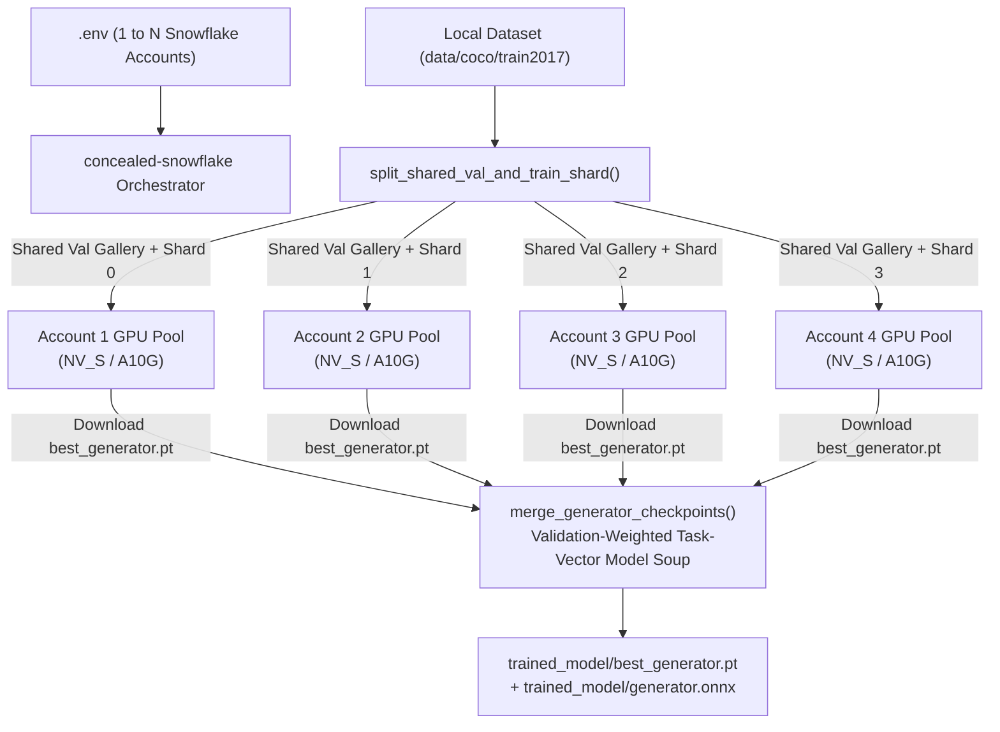

# Concealed

**Amortized Adversarial Generator Network & Hybrid ViT Refinement Pipeline for Real-Time Image & Video Obfuscation Against Vision Transformers.**

`Concealed` trains a compact, 100% ONNX-native neural network ($G_\theta$) that synthesizes visually imperceptible, $L_\infty$-bounded perturbations ($\delta = G_\theta(x)$, $\|\delta\|_\infty \le \epsilon$) designed to disrupt open-source and frontier Vision Transformer (ViT) representations (`SigLIP`, `CLIP`, `DINOv2`, `ConvNeXt`, `EVA-02`) in real-time pipelines, with support for whole-image protection, video streams, and targeted silhouette-conforming feature obscuring without introducing visible color casts or skin-wrinkle distortions.

---

## Key Capabilities

1. **Two-Tier Inference (Zero-Shot Real-Time + Hybrid High-Pass ViT Refinement)**:
   - **Zero-Shot Amortized Pass (`<10ms` GPU / `<40ms` CPU)**: A ~1.8M parameter U-Net generator (`base` preset) predicts image-adaptive perturbations in a single forward pass and exports cleanly to **ONNX**, **INT8 ONNX**, and **TorchScript** for real-time video/webcam streams.
   - **Hybrid High-Pass ViT Refinement (`--refine-steps`)**: For static high-resolution photos (`720p`/`1080p`/`4K`), warm-starts from the generator's prediction and runs a fast, edge-locked multi-scale (`224x224` + `384x384`) Adam refinement loop with Total Variation (TV) smoothness and native-resolution skin protection (`PSNR > 46 dB`, `SSIM > 0.994`).
2. **Hybrid Global + High-Res Tile Synthesis (`hybrid` mode)**:
   - **Global Canonical Residual Branch**: Synthesizes perturbations at a ViT-aligned canonical scale ($384\times 384$) and bilinearly upsamples only the residual $\delta$ to the native image resolution—preventing anti-aliased downsampling cancellation on $1080\text{p}/4\text{K}$ images while keeping original pixels 100% sharp.
   - **High-Res $2\times 2$ Tile Grid Branch**: Simultaneously targets high-resolution local tile crops used by modern frontier VLMs (GPT-4o high-detail mode, Qwen2-VL, InternVL, LLaVA-NeXT).
3. **Wrinkle-Free Perceptual & Chrominance Stealth**:
   - **Pre-Upsample Soft `tanh` + Bicubic Smoothing**: Bounds canonical perturbations *before* upsampling to native HD/4K resolution so zero-crossings never form sharp step-edge contour lines ("wrinkles") across faces.
   - **YCbCr Opponent Chrominance Damping**: Suppresses RGB opponent color channels ($\Delta C_b, \Delta C_r$) by 70–82% so perturbations operate almost purely along luminance edges (`Opponent Chroma Shift < 0.20/255` — zero purple/green tint).
   - **Scale-Invariant `WeberTextureMask`**: Concentrates perturbation budget onto high-frequency textures (hair, eyeglasses, fabric weave, brick mortar) while keeping flat backgrounds and smooth facial skin calm.
4. **Multi-Account Snowflake SPCS GPU Fleet Orchestration (`concealed-snowflake`)**:
   - Automatically discovers all Snowflake accounts configured in a single `.env` file (`SNOWFLAKE_ACCOUNT`, `SNOWFLAKE_ACCOUNT_2`, `SNOWFLAKE_ACCOUNT_3`, `SNOWFLAKE_ACCOUNT_4`, ...).
   - Splits the dataset into a **deterministic shared validation gallery** + **disjoint per-account training shards**, streams color-coded live telemetry from all GPU containers in parallel, and merges the resulting checkpoints via **Validation-Weighted Task-Vector Model Soup** (`--merge`).
5. **Pluggable Open-Source Surrogate Profiles & Ensembles**:
   - Out-of-the-box support for **Google SigLIP** (`google/siglip-*`), **OpenAI / Apple DFN / LAION CLIP** (`openai/clip-*`, `apple/DFN5B-*`, `laion/CLIP-convnext_*`), **Meta DINOv2** (`facebook/dinov2-*`), **GLM-OCR** (`zai-org/GLM-OCR`), and any **`timm` Vision Transformer** (`timm/vit_*`, `timm/eva02_*`, `timm/swin_*`).
   - Disrupts **both global `[CLS]`/pooled embeddings and multi-layer intermediate spatial patch tokens** (`tap_layers: [-4, -2, -1]`) wrapped in **Differentiable EOT** (`DiffJPEG` + DI-FGSM multi-scale resize + VLM tile cropping).
   - Sequential gradient accumulation (`sequential_grad_accum: true`) frees each surrogate's activation graph immediately after its backward pass so multi-model ensembles fit comfortably in 16 GB VRAM without CPU-offload slowdowns.
6. **Feature-Targeted Silhouette Obfuscation**:
   - Detects specific visual features (face, arms, text, tables, water bottles, laptops, and arbitrary objects) and applies protection strictly conforming to the object's silhouette.

---

## System Architecture

```mermaid
flowchart LR
    subgraph Input["Input Image x [B, 3, H, W]"]
        X["Clean RGB Image\n[0, 1]"]
    end

    subgraph Generator["AmortizedObfuscationGenerator (G_θ)"]
        Scale["Canonical (256×256) &\nTile (384×384) Branches"]
        DCT["DCTFilterBankStem\n48× 8×8 2D-DCT Basis + 3×3 Spatial"]
        Enc["3-Stage ConvNeXt Encoder\n7×7 Depthwise + GroupNorm + SE"]
        Bot["BottleneckSelfAttention\n1/8 Scale + 16×16 SR-Attention"]
        Dec["3-Stage U-Net Decoder\nSkip Connections + Zero-Bias Head"]
        HP["Zero-DC High-Pass (9×9)\n+ Content-Adaptive Structural Gate"]
        Up["Pre-Upsample tanh()\n+ Native (H, W) Interpolation"]
        Chroma["YCbCr Chroma Damping (70%)\n+ Scale-Invariant WeberTextureMask"]
    end

    subgraph Training["Training & Evaluation Loop (Differentiable)"]
        EOT["DifferentiableEOT\nDiffJPEG + DI-FGSM Scale + Tile Crop"]
        Surr["Frozen Surrogate Ensemble\nSigLIP / CLIP / DINOv2 / ConvNeXt\nTap Layers: [-3, -2, -1] & Global [CLS]"]
        Loss["ObfuscationLoss\nSalience Foreground Cosine + Patch-Swap InfoNCE\n+ Batch Anti-UAP + YCbCr/Weber/SSIM/TV"]
    end

    X --> Scale --> DCT --> Enc --> Bot --> Dec --> HP --> Up --> Chroma
    X --> Chroma
    Chroma -->|"x_adv = clamp(x + δ, 0, 1)"| EOT --> Surr --> Loss
    Loss -.->|"∇_θ L (Seq Grad Accum)"| Generator
```



### 1. Generator Network ([`concealed/models/generator.py`](concealed/models/generator.py))

- **`DCTFilterBankStem`**: Projects the input RGB tensor into 48 spatial-frequency sub-bands using an $8\times 8$ depthwise `nn.Conv2d` initialized with orthonormal 2D Discrete Cosine Transform (DCT-II) basis functions (selecting DC, low, and ViT-patch harmonic frequencies), fused with a $3\times 3$ spatial convolution.
- **Encoder–Decoder U-Net (`ConvNeXtDepthwiseBlock`)**:
  - Three encoder and decoder stages (`c1 -> 2*c1 -> 4*c1 -> 4*c1`) built from $7\times 7$ depthwise-separable inverted residual blocks with `GroupNorm`, `SiLU`, and `SqueezeExcitation` channel attention.
  - The $7\times 7$ depthwise kernel matches half the $14\times 14$ / $16\times 16$ ViT patch stride to synthesize patch-boundary-disrupting patterns efficiently.
  - Available capacity presets: `tiny` (~0.45M params), `base` (~1.8M params), and `large` (~6.2M params).
- **`BottleneckSelfAttention` (Spatial-Reduction Attention)**:
  - Multi-head self-attention at the `1/8` bottleneck pools Keys and Values to a fixed $16\times 16$ (`256`-token) spatial context grid, reducing complexity from $O((HW)^2)$ to $O(HW \cdot 256)$ while preserving global long-range receptive field across all ViT patches.
- **Anti-Collapse Zero-DC High-Pass & Structural Gate**:
  - All decoder output head layers (`self.head`) use `bias=False` so the network cannot collapse into a static, image-independent Universal Adversarial Perturbation (UAP).
  - Strips low-frequency ($>9\times 9$ px) background blotches via `raw = raw - avg_pool2d(raw, 9)` and multiplies by a content-adaptive structural edge gate (`0.65 + 0.70 * tanh(16 * |x - avg_pool2d(x, 7)|)`).
- **Multi-Scale Synthesis (`hybrid`, `canonical_residual`, `native`)**:
  - In `hybrid` mode, predicts perturbations at both a global `canonical_size` ($256\times 256$, surviving thumbnail downsampling) and a local `tile_size` ($384\times 384$, targeting high-res tile-slicing VLMs), applying `torch.tanh` *before* interpolating to native $(H, W)$ resolution.
- **YCbCr Chrominance Damping & `WeberTextureMask`**:
  - Decomposes $\delta$ into luminance $\Delta Y = 0.299 \Delta R + 0.587 \Delta G + 0.114 \Delta B$ and chrominance $\Delta C = \delta - \Delta Y$, attenuating $\Delta C$ by 70%.
  - Multiplies $\delta$ by `WeberTextureMask(x)`, which combines native-resolution and canonical $224\times 224$ Sobel gradient magnitudes via geometric mean so high-resolution smooth skin and flat walls remain clean.

### 2. Differentiable EOT & Loss Pipeline ([`concealed/losses/`](concealed/losses/))

- **`DifferentiableEOT` ([`concealed/losses/eot.py`](concealed/losses/eot.py))**:
  - **Paired Alignment**: Applies identical random spatial transforms to $(x, \tilde{x})$ so patch-level cosine similarity remains spatially aligned.
  - **Input Diversity (DI-FGSM)**: Random multi-scale bilinear/bicubic resize (`0.90–1.10`) and reflection padding.
  - **Differentiable JPEG (`DiffJPEG`)**: Full $8\times 8$ block DCT/IDCT + luminance/chrominance quantization table rounding with Straight-Through Estimator (STE).
  - **VLM High-Res Tile Cropping**: Randomly extracts high-resolution sub-tiles to defeat dynamic-resolution VLMs (GPT-4o, Qwen2-VL, InternVL).
- **`ObfuscationLoss` ([`concealed/losses/obfuscation_loss.py`](concealed/losses/obfuscation_loss.py))**:
  - **Salience-Weighted Foreground Patch Cosine Repulsion**: Computes clean token feature salience (`||f_i - mean(f)||_2`) and weights foreground patches (faces, people, focal objects) up to $3\times$ higher than flat background patches across intermediate transformer layers (`tap_layers: [-3, -2, -1]`).
  - **Intra-Image Spatial Patch-Swap InfoNCE**: Pulls each obfuscated foreground token toward the most dissimilar background patch within the same image (`temperature = 0.15`), actively scrambling spatial layout and self-attention routing.
  - **Batch Anti-UAP Decoupling Penalty**: Penalizes the cross-batch mean perturbation (`delta.mean(dim=0).pow(2).mean()`) to enforce image-specific perturbations (`UAP Ratio < 0.15`).
  - **Perceptual Stealth Terms**: Weber-weighted $L_2$ loss + YCbCr opponent chroma penalty + Multi-Scale SSIM + Total Variation (TV) + optional LPIPS.

### 3. Multi-Account Snowflake GPU Fleet ([`concealed/snowflake_cli.py`](concealed/snowflake_cli.py))




---

## Installation

```bash
# Using uv (recommended)
uv sync

# Or standard pip
pip install -e ".[dev,perceptual]"
# Or via requirements:
pip install -r requirements.txt
```

---

## Quickstart & CLI Reference

### 1. Multi-Account Snowflake GPU Fleet Training (`concealed-snowflake`)

Configure one or more Snowflake accounts in `.env`:

```ini
# Account 1 (Primary)
SNOWFLAKE_ACCOUNT=org1-acct1
SNOWFLAKE_USER=USER1
SNOWFLAKE_PASSWORD=...

# Account 2..N (Additional Parallel GPU Accounts)
SNOWFLAKE_ACCOUNT_2=org2-acct2
SNOWFLAKE_USER_2=USER2
SNOWFLAKE_PASSWORD_2=...
```

Launch parallel training across all configured accounts (automatically stages code, pre-cached HuggingFace weights, and disjoint image shards, streams live epoch metrics, and merges checkpoints on completion):

```powershell
# Fast single-model SigLIP PoC across all Snowflake accounts
uv run concealed-snowflake --profile fast --surrogates google/siglip-base-patch16-224 --epochs 15 --batch-size 16 --lr 0.0005

# Full 4-model fast profile (SigLIP-B/16 + CLIP-B/16 + DINOv2-Base + ViT-Tiny)
uv run concealed-snowflake --profile fast --epochs 20 --batch-size 12

# Check live fleet status / download & merge existing checkpoints / clean remote stages
uv run concealed-snowflake --status
uv run concealed-snowflake --merge
uv run concealed-snowflake --clean
```

### 2. Local GPU Training (`concealed-train`)

```bash
uv run concealed-train \
  --config configs/default.yaml \
  --profile fast \
  --data-dir data/coco/train2017 \
  --output-dir runs/exp1 \
  --epochs 15 \
  --batch-size 16
```

### 3. Obfuscate Images / Video & Run Analytics Report (`concealed-infer`)

```powershell
# Obfuscate a high-res photo with 12-step wrinkle-free Hybrid ViT Refinement + side-by-side comparison + analytics report
uv run concealed-infer \
  --model ./trained_model/best_generator.pt \
  --input ./photo.jpg \
  --output ./photo_concealed.png \
  --refine-steps 12 \
  --save-comparison

# Pure zero-shot single-pass inference (no iterative refinement) on an image folder or MP4 video
uv run concealed-infer \
  --model ./trained_model/generator.onnx \
  --input ./raw_images \
  --output ./obfuscated_images \
  --refine-steps 0
```

Example output from `concealed-infer`:
```text
+=======================================================================================+
| CONCEALED IMAGE OBFUSCATION & IDENTIFICATION ANALYTICS REPORT
+=======================================================================================+
| Resolution     : 1280x720
| Visual Stealth : PSNR = 46.18 dB | SSIM = 0.9942 | L_inf = 7.00/255 | RMSE = 1.25/255
| Color Purity   : Opponent Chroma Shift = 0.16/255 (Low = no purple/green tint)
+---------------------------------------------------------------------------------------+
| Vision Transformer Feature & Identification Breakdown:
|  * siglip-base-patch16-224
|      Patch Cosine Sim        : 0.5828  (Salient Foreground Faces/Objects: 0.6600)
|      Global [CLS] Cosine Sim : 0.7654
|      Concealed Spatial Grid  :  63.6% (<0.70 sim) |  39.3% (<0.50 sim)
|      Feature Re-ID Evasion   :  56.0% of patch features misidentified |  44.2% salient focus displaced
|      Identification Status   : [EVADED / SCRAMBLED]
+=======================================================================================+
```

### 4. Evaluate Black-Box Transferability (`concealed-eval`) & Export (`concealed-export`)

```bash
# Evaluate zero-shot disruption on training + held-out Vision Transformers
uv run concealed-eval \
  --checkpoint trained_model/best_generator.pt \
  --data-dir data/coco/train2017 \
  --extra-surrogates openai/clip-vit-large-patch14 timm/vit_base_patch16_224 \
  --output-json trained_model/eval_report.json

# Export to Dynamic-Axis ONNX + Quantized INT8 ONNX + TorchScript
uv run concealed-export \
  --checkpoint trained_model/best_generator.pt \
  --output trained_model/generator.onnx \
  --quantize-int8 \
  --torchscript trained_model/generator.torchscript.pt
```

### 5. Python Pipeline Usage

```python
from PIL import Image
from concealed.pipeline.realtime import RealtimeObfuscator

# Load either a PyTorch (.pt) checkpoint or an exported ONNX (.onnx) model
obfuscator = RealtimeObfuscator("runs/exp1/generator.onnx", device="cuda")

# 1. PIL Image (preserves exact native resolution)
img = Image.open("photo.jpg")
protected_img = obfuscator.obfuscate_pil(img)
protected_img.save("photo_protected.jpg")

# 2. OpenCV BGR Video Frame (for 30-60+ FPS streaming pipelines)
# protected_frame = obfuscator.obfuscate_bgr_frame(frame_bgr)
```

### 6. Feature-Targeted Silhouette Obfuscation

```bash
# Modify faces conforming to head contour
python image_processor.py my_photo.png --feature face

# Modify arms conforming to limbs
python image_processor.py my_photo.png --feature arms

# Modify all text in the image
python image_processor.py document.png --feature text

# Modify custom objects
python image_processor.py room.png --feature laptop
python image_processor.py street.png --feature people
```

---

## Repository Structure

```text
concealed/
├── data/
│   └── dataset.py            # Unlabeled image dataset, deterministic validation split & multi-account sharding
├── losses/
│   ├── eot.py                # Differentiable EOT (DiffJPEG 8x8 DCT, DI-FGSM scale, VLM tile cropping)
│   └── obfuscation_loss.py   # Salience foreground cosine, patch-swap InfoNCE, anti-UAP, YCbCr/Weber/SSIM/TV
├── models/
│   ├── generator.py          # AmortizedObfuscationGenerator, DCTFilterBankStem, BottleneckSelfAttention, WeberTextureMask
│   └── surrogates.py         # Pluggable frozen ViT/ConvNeXt surrogate wrappers & sequential gradient accumulation
├── pipeline/
│   ├── export.py             # Dynamic-axis ONNX, INT8 quantization, and TorchScript exporter
│   └── realtime.py           # RealtimeObfuscator, wrinkle-free Hybrid ViT Refinement, and ViT analytics report
├── evaluate.py               # Black-box transferability evaluation CLI
├── snowflake_cli.py          # Multi-account Snowflake SPCS GPU fleet provisioner, live streamer & Model Soup merger
└── train.py                  # Training loop, Spatial Patch Re-ID validation, and Task-Vector Model Soup merge
```

